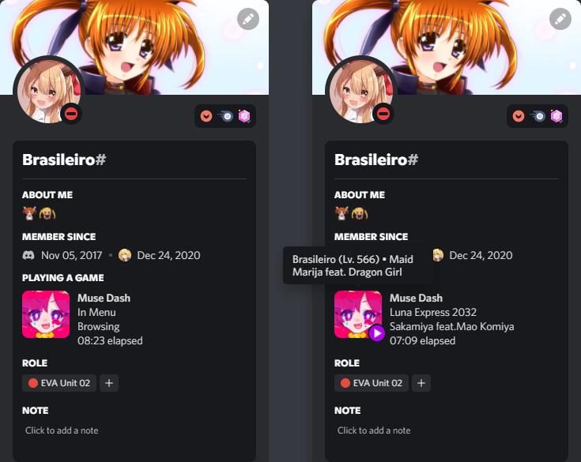

# MDRPC
Enhanced Discord Rich Presence for Muse Dash.

The aim of this project is to improve the Rich Presence of Muse Dash by adding some important information. With MelonLoader and Harmony, doing this kind of thing with Il2Cpp games just got a lot simpler.

In addition to the song and artist name, and the difficulty, it also shows the player's name (within Muse Dash), the character and elfin selected for the song. It also shows the total time played in the session.

# Installation
1. Install [MelonLoder](https://github.com/LavaGang/MelonLoader).
2. Download the [latest release](https://github.com/Braasileiro/MDRPC/releases/latest) and extract the zip contents on the **"Mods"** folder in the Muse Dash installation directory.

# Usage
Just play the game my little PogChamp. The Discord Activity will show up.

**Please make sure your Discord is open before the game. If you open Discord after the game, you will have to restart the game for the Discord status to work.**

# Known Issues
* Sometimes the current player's level doesn't match the showed in-game.
* The level of hidden songs appears incorrectly.

Both problems I believe are due to using a JSON (which is not always up to date apparently). I'm looking for a way to get this directly from some game object at runtime.

If anyone already knows how to get to these variables at runtime I would be very grateful. :pensive:

# Thanks
This mod is based on the [DiscordPlus](https://github.com/mo10/DiscordPlus).

# Showcase

  

